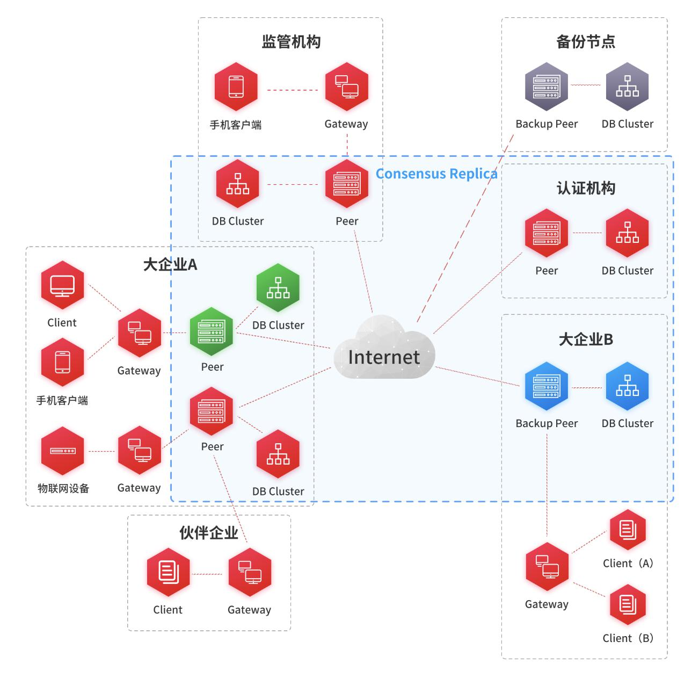

[TOC]
#JD区块链

[](https://www.apache.org/licenses/LICENSE-2.0.html)
[](https://maven-badges.herokuapp.com/maven-central/com.jd.blockchain/sdk-pack/)
[](https://travis-ci.org/blockchain-jd-com/jdchain)


------------------------------------------------------------------------

## 一、项目介绍
JD Chain 的目标是实现一个面向企业应用场景的通用区块链框架系统，能够作为企业级基础设施，为业务创新提供高效、灵活和安全的解决方案。


## 二、部署模型

JD Chain 主要部署组件包括以下几种：

- 共识节点
    
    共识节点即参与共识的节点，这是系统的核心组件，承担了运行共识协议、管理账本数据、运行智能合约的职责。
    
    一个区块链网络由多个共识节点组成，共识节点的数量范围由选择的共识协议决定。

    共识节点和账本是两个不同的概念，共识节点是个物理上的概念，账本是个逻辑上的概念。JD Chain 是一个多账本区块链系统，一个共识节点上可以装载运行多个账本。账本是数据维度的独立管理单元。共识节点和账本的关系，就像关系数据库系统中，数据库服务器和数据库实例的关系。

    共识节点通常都部署在参与方的内部网络中，通过由网络管理员指定的安全的网络出口与其它的共识节点建立通讯连接。

    共识节点在形态上是服务器中的一个处理进程，背后需要连接一个本地或者内网的NoSQL数据库系统作为账本的存储。当前版本，共识节点目前是单进程的，未来版本将实现多进程以及多服务器集群模式。

- 网关节点

    网关节点是负责终端接入的节点，负责终端连接、协议转换、交易准入、本地密码运算、密钥管理等职责。

    网关节点是一种轻量节点，需要绑定一个特定参与方的密钥对，连接到一个或多个共识节点。

    网关节点向共识节点的连接是需要通过认证的，绑定的参与方的密钥对必须事先已经注册到区块链账本中，且得到接入授权。

- 终端

    终端泛指可以提交交易的客户端，典型来说，包括人、自动化设备、链外的信息系统等。

    终端只能通过网关节点来提交交易。终端提交的交易需要用体现该终端身份的私钥来签署，产生一份电子签名。随后当交易提交给网关节点时，网关节点需要在把交易提交到共识节点之前，对交易请求以网关节点绑定的私钥追加一项“节点签名”。


- 备份节点

    仅对账本数据提供备份，但不参与交易共识的节点。（注：目前版本中尚未实现，将在后续版本中提供）





## 三、编译源代码

 1. 安装 Maven 环境

    JD Chain 当前版本以 Java 语言开发，需要安装配置 JVM 和 Maven，JDK 版本不低于1.8 。(没有特殊要求，请按标准方法安装，此处不赘述)
 
 2. 安装 Git 工具
    
    为了能够执行 git clone 命令获取代码仓库。 (没有特殊要求，请按标准方法安装，此处不赘述)
 
 3. 工程代码

    JD Chain 源代码包括 3 个代码仓库

    - jdchain
        - 这是当前仓库，也是核心仓库，包含了共识节点、网关节点、SDK等一切部署组件。依赖于 explorer 和 bftsmart 这两个仓库先进行编译安装；
        
    - explorer
        - 这是区块链浏览器的前端Web页面的工程，需要编译成静态资源包，由网关节点集成到一起部署。
        - 地址：git@github.com:blockchain-jd-com/explorer.git

    - bftsmart
        - 这是bftsmart共识协议的工程，需要先编译安装到本地 maven 仓库；


4. 命令操作

- 编译安装 explorer 到本地 maven 仓库；
```sh
    $ git clone git@github.com:blockchain-jd-com/explorer.git explorer

    $ cd explorer

    $ git checkout master

    $ mvn clean install
    
```
- 编译安装 bftsmart 到本地 maven 仓库；
    - 需要手动先安装一个第三方包，位于仓库根目录下 lib/core-0.1.4.jar 
```sh
    $ git clone git@github.com:blockchain-jd-com/bftsmart.git bftsmart

    $ cd bftsmart

    $ git checkout master
    
    $ mvn install:install-file -Dfile=lib/core-0.1.4.jar -DgroupId=com.yahoo.ycsb -DartifactId=core -Dversion=0.1.4 -Dpackaging=jar

    $ mvn clean install
    
```
- 编译 jdchain 工程；
    - 当编译完成后，共识节点的安装包位于 "仓库根目录"/source/deployment/deployment-peer/target/jdchain-peer-1.0.1.RELEASE.zip
    - 当编译完成后，网关节点的安装包位于 "仓库根目录"/source/deployment/deployment-gateway/target/jdchain-gateway-1.0.1.RELEASE.zip

```sh
    $ git clone git@github.com:blockchain-jd-com/jdchain.git jdchain

    $ cd jdchain/source

    $ git checkout master

    $ mvn clean package
    
```
